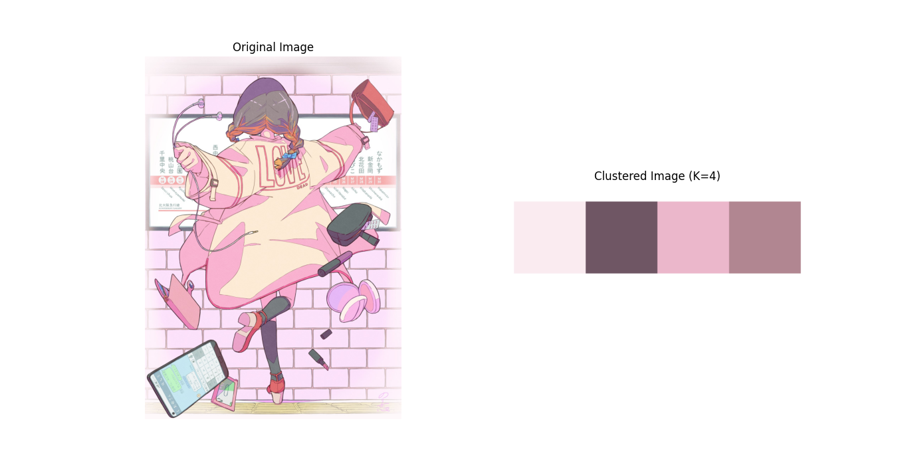

# GetMainColor
- 画像に使われているメインカラーを調べるプログラム

## 使用技術・ライブラリ
- python
  - tkinter
  - matplotlib
  - opencv
  - PIL
  - sklearn
 
## 使用例
以下の画像を入力すると...


下記のように分析結果が出る。

```
1位：#faebf0
2位：#6f5664
3位：#ebb7cb
4位：#b18691
```

